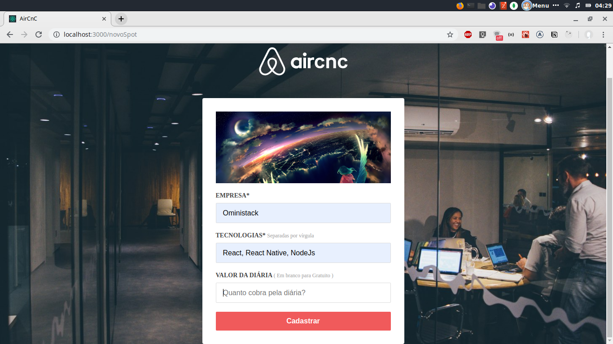
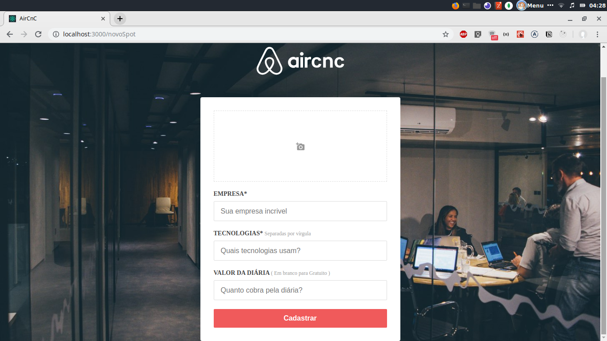
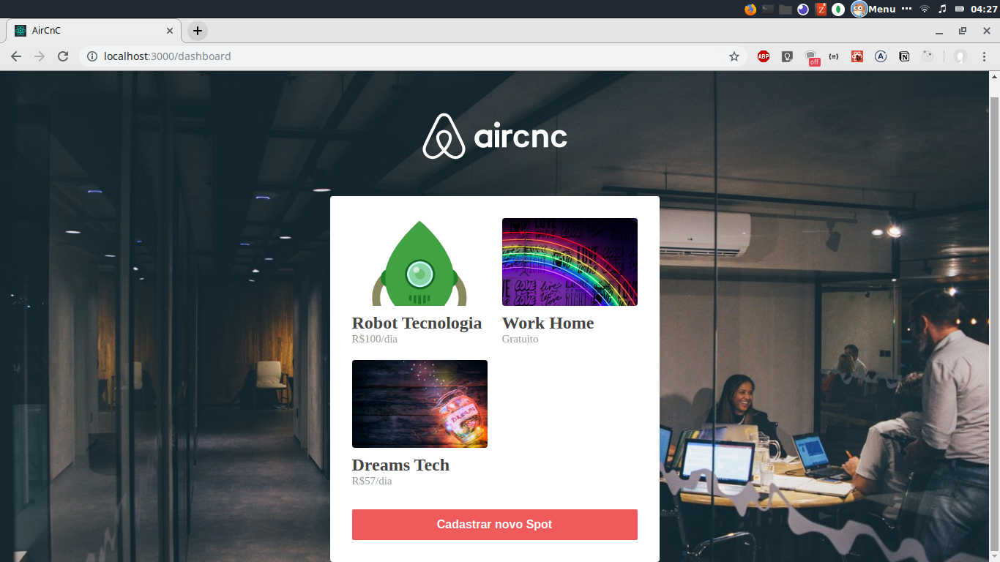
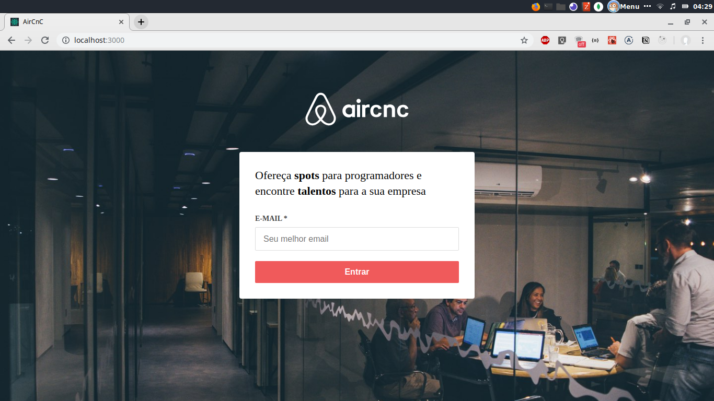

# Web Aplication Semana OminiStack dia 3

    
      
    
    
    
    
  <h2 align="center">  </h2>

...
### Configuração extra e atalhos para melhorar produtividade no Vscode 

  `"emmet.syntaxProfiles": {"javascript": "jsx"}, 
   "emmet.includeLanguages": {"javascript": "javascriptreact"}`

- `Alt e seta para cima e para baixo` :=> inverte posições das linhas
- `ctrl + Up tecla + Seta`:=> seleciona linha na vertical 

<<<<<<< HEAD
Hack responsivo
  max-width: 450px;
  width: 100%;

- Socket.io-cliente : possibilita a conexão instantânea do frontend com o servidor, implementação do frontend
=======
  Hack responsivo
    max-width: 450px;
    width: 100%;
>>>>>>> 1d7f46e7e80bfb52d17cdd7ad5e1672c7bd2261b
