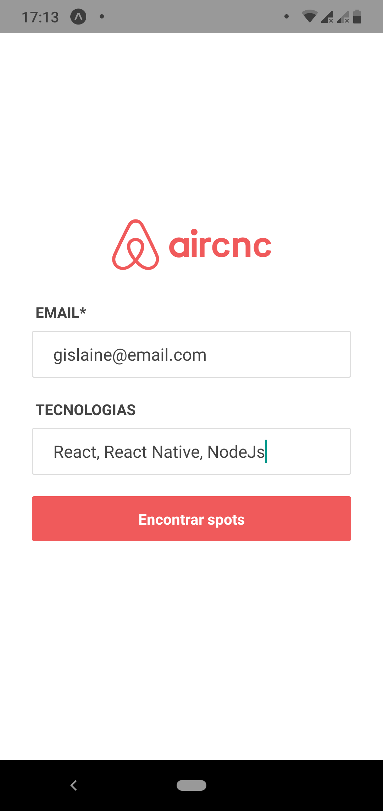
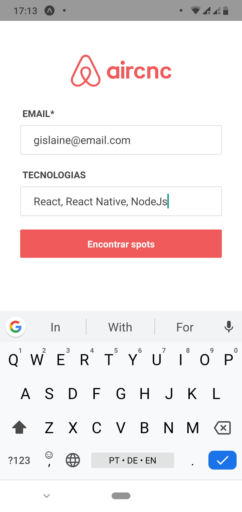
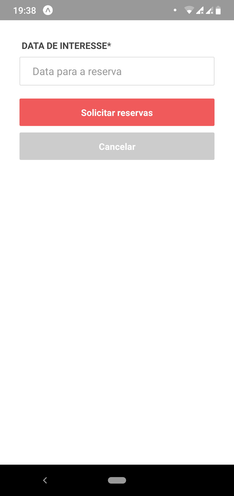
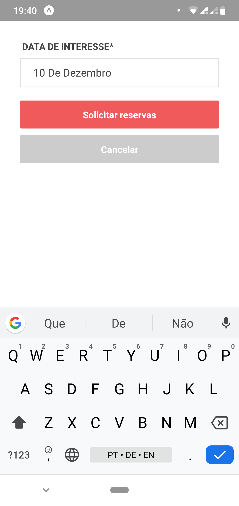

# Aplicação Mobile - AirCnC: Baseado na ideia do AirBnB

## Prints das telas desenvolvidas

<p align="rigth">
    
       
     <br/>
     
     <br/>
  
  <h2 align="center">  </h2>
</p>

Se eu atualizo a aplicação volta para o login, pois não tá por padrão memorizado no app, então temos que fazer o seguinte...

=>  Se Usuario estiver logado no sistema

```js
  useEffect(()=> {
        AsyncStorage.getItem('usuario').then(usuario => {
            if (usuario)
                navigation.navigate('Listagem')
        })
    }, [])
```
Templete do useeffect: para entender como funciona esse Hook
```js
 useEffect(() => {
        console.log("Efeito lógica")
        return () => {
            console.log("Limpar alguma variavel do sistema")
        };
    }, ["Dependencias, que farão efeito ser acionado em caso de mudanças"])
```

*  *rnfc* Atalho para criação de componentes funcionais

